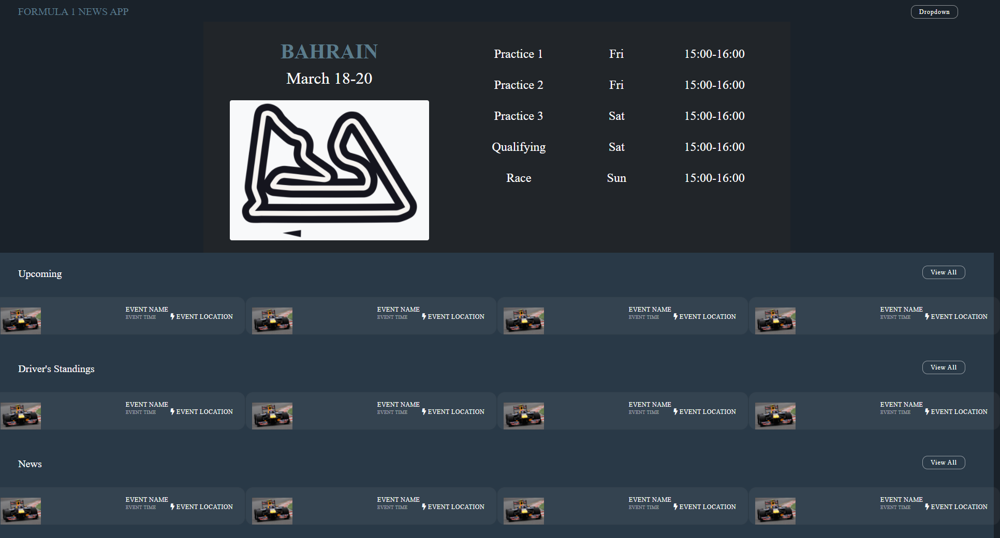

# F1 Formula Frenzy
[](https://bootcamp.msu.edu/)

## Technologies


## Description
As F1 Formula fans, there is a need to view F1 Formula news, teams, and races at a simpler design. For that reason, we designed and developed a simple application that allows users to keep track of the news, teams, and events related to the F1 Formula race. The front-end of the application was developed in HTML, CSS, and Bootstrap. The back-end of the application was developed in JavaScript. We used two different APIs to gather the information of the F1 Formula. The first API that we used was [api-sports](https://api-sports.io/documentation/formula-1/v1). The second API that we used was [newscatcher-api](https://rapidapi.com/newscatcher-api-newscatcher-api-default/api/free-news/).

## User Story
```
AS A devoted F1 fan 
I WANT to see F1 news, teams, and upcoming races
SO THAT I can keep up with the latest information related to F1
```

## Acceptance Criteria
```
GIVEN
WHEN
THEN
WHEN
THEN
WHEN
THEN
```

## Screenshot


## Link
A link to the [code](https://github.com/Sccr0123/Formula-1-Frenzy):
```
https://github.com/Sccr0123/Formula-1-Frenzy
```

A link to the deployed [URL]():
```

```

## Developers
- :computer: [Zach Thomas](https://github.com/Sccr0123)
- :computer: [Juan Garcia](https://github.com/jgarcia45)
- :computer: [Manny Garcia](https://github.com/mannygarcia98)
- :computer: [Chen Wang](https://github.com/wangheer2010)
- :computer:  [Mo Yang](https://github.com/moyangdev)